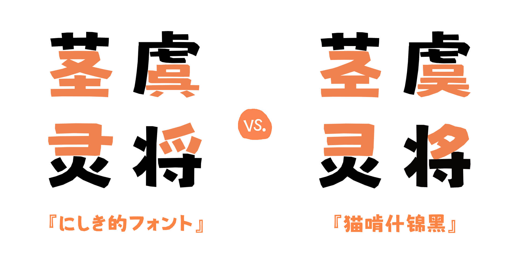
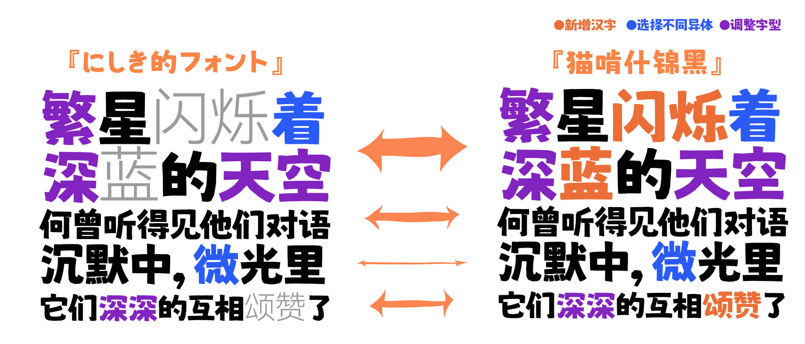
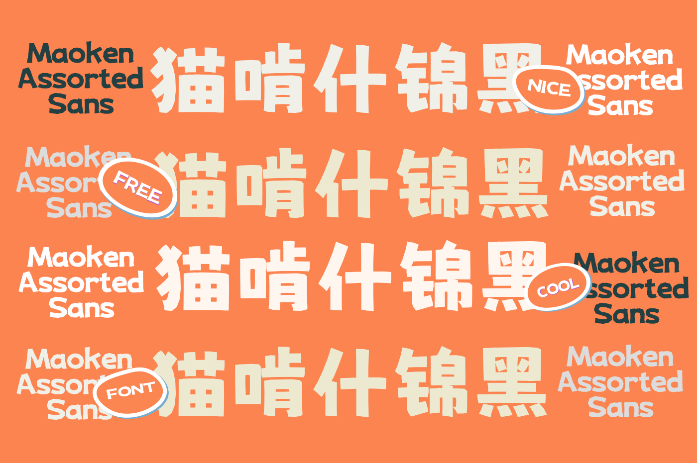
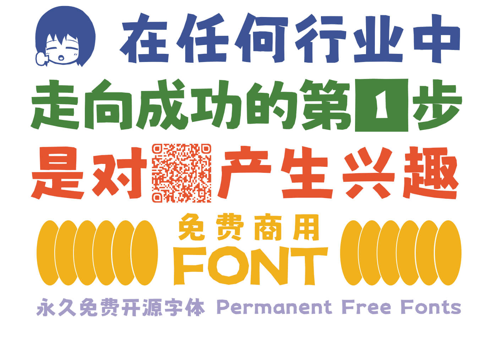
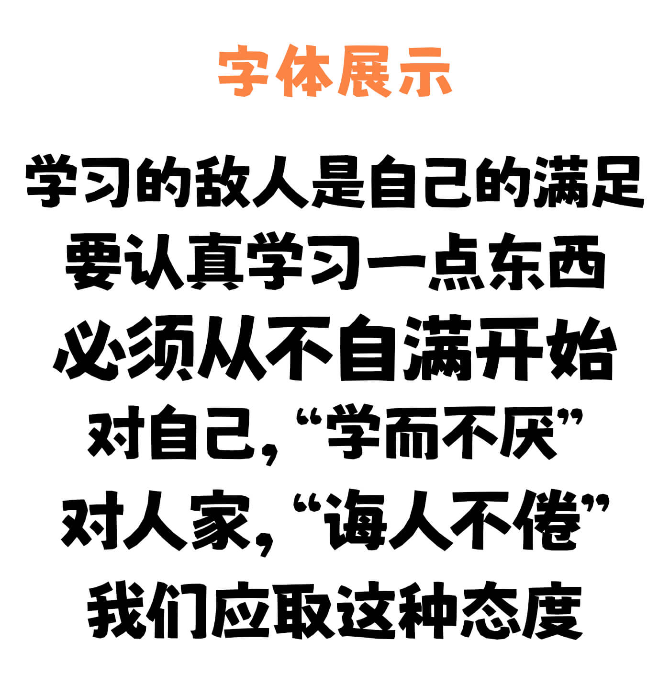
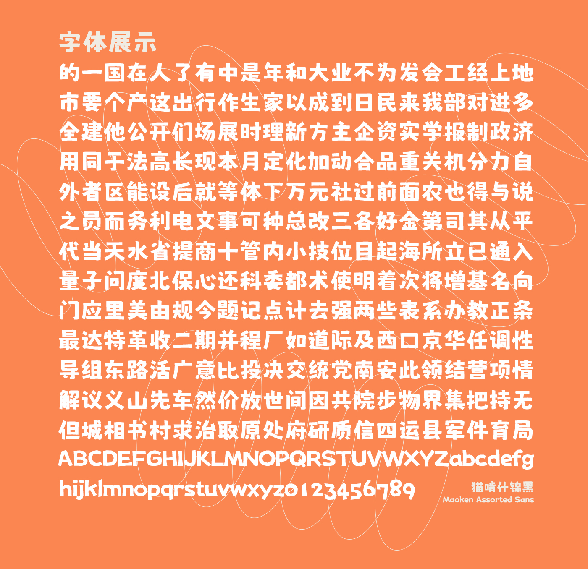
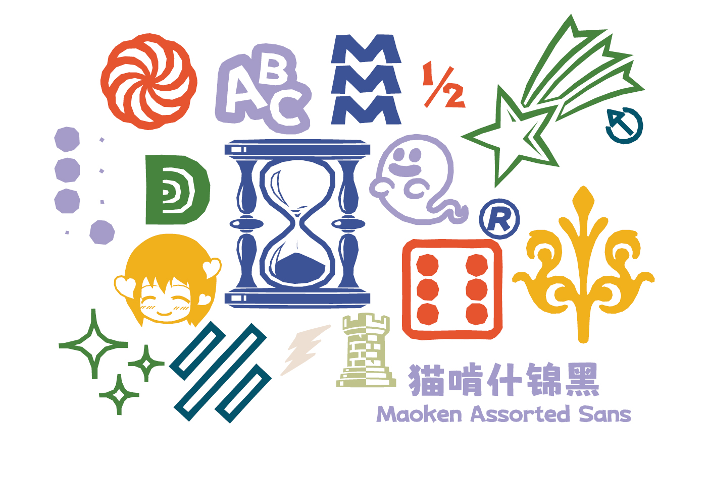

# 猫啃什锦黑

## 简介

猫啃什锦黑是基于日本作者Umihotaru创作的字体[《にしき的フォント》（Nishiki-teki）](https://umihotaru.work/)进行简体字补充并对其中的汉字字形进行修改，以满足简体中文使用需求的字体，是一款可爱的马克笔手绘风格免费商用字体，笔画活泼、有趣，特别适合用于可爱类、母婴类等海报的标题。

目前已做完GB/T 2312和《通用规范汉字表》前两级的全部汉字。后续版本将补齐《通用规范汉字表》的三级汉字和《现代汉语通用字表》内的全部汉字。

## 字体预览

## 授权信息

原字体的授权说明如下：（请于 https://umihotaru.work/faq.txt 查看原文）

> 在 https://umihotaru.work 上发布的《にしき的フォント》等字体，对于一般的使用没有任何限制。您可以自由地将这些字体用于任何目的，私人或商业用途。
> 
> 允许以任何形式进行再分发，包括与游戏档案捆绑在一起。如果是再分发，请明确说明转发来源（如果来源已经消失，则不必说明）。
> 
> 如果需要修改字体使用，请在字体名称后加“_mod”等，以区别于原字体。如果您重新发布该字体，请注明该字体为修改后的字体，并注明发布者姓名。

本字体谨照此说明。

### 允许
- 一切商业使用；
- 转载、分享字体文件；
- 将字体文件嵌入软件中；
- 修改字体或制作衍生版本，需注明该字体为改造后的字体，并注明改造来源。

### 不允许
- 将该字体作为商品进行售卖或进行变相收费（包括但不限于积分下载，与其他字体捆绑售卖，设置任何权限门槛等）；
- 用于违反国家法律和公序良俗的任何场景；
- 在制作衍生字体时，字体名称使用“什锦”“Assorted”等词语。

若对本字体有意见或问题，欢迎于[issue页面](https://github.com/Skr-ZERO/MaokenAssortedSans/issues)提出。

## 下载通道

进入[“Release”界面](https://github.com/Skr-ZERO/MaokenAssortedSans/releases)下载对应版本的 TTF 或 OTF 文件。

## 致谢

- [波間のかけひき](https://twitter.com/Umihotarus) 提供原版字体；
- @白日月球、@阿東東東東、@荆南字坊、@时光羊、@帆影Shadow、@频凡、@Y^Lin、@orunji协助补字；
- 所有下载使用的朋友。

## 打赏支持

**如果这款字体对您的设计起到了帮助作用，欢迎打赏支持。**

